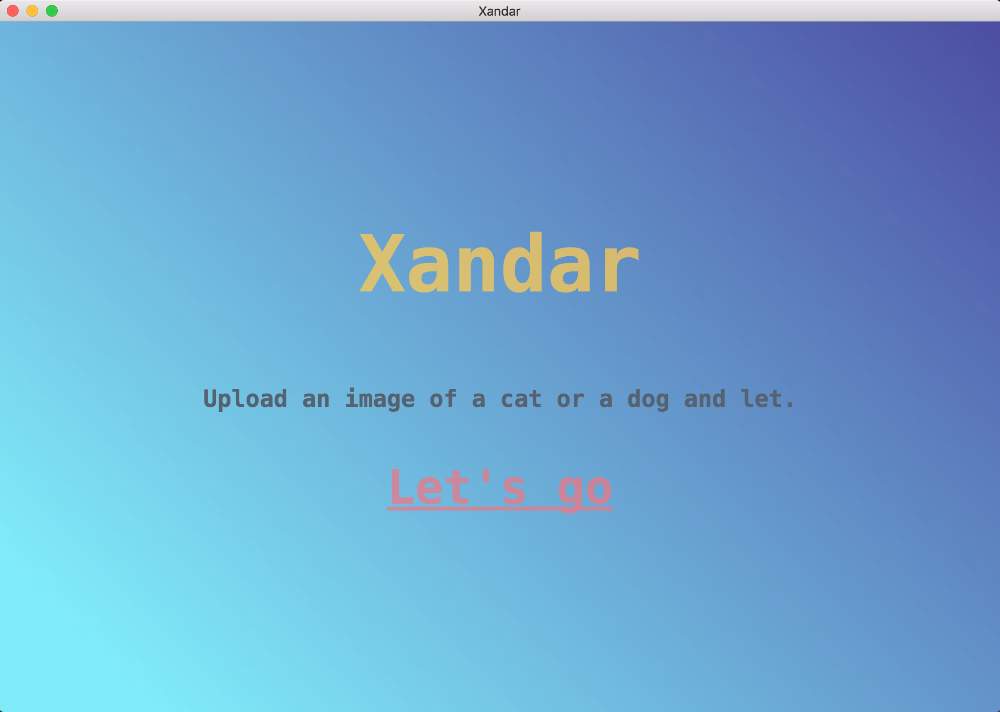
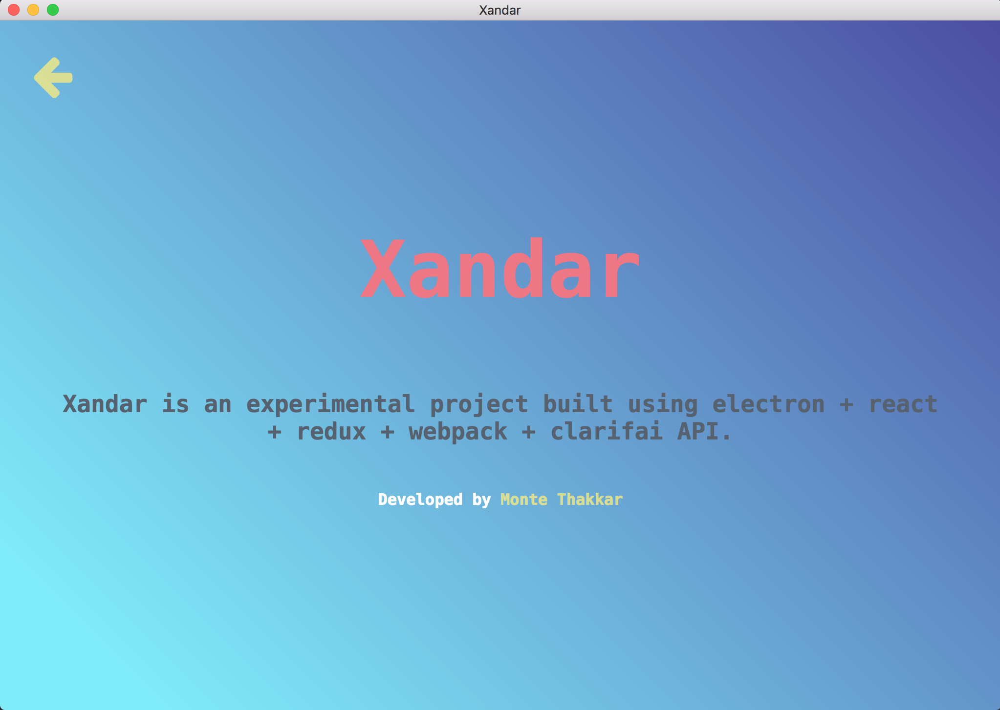

# Xandar

> is it a cat or a dog or neither?

[Electron](http://electron.atom.io/) application boilerplate based on [React](https://facebook.github.io/react/), [Redux](https://github.com/reactjs/redux), [React Router](https://github.com/reactjs/react-router), [Webpack](http://webpack.github.io/docs/), [React Transform HMR](https://github.com/gaearon/react-transform-hmr) for rapid application development.

Also using [Clarifai API](https://github.com/Clarifai/clarifai-javascript) for image processing.

## Screenshot

## electron-react-boilerplate

This project is forked from [electron-react-boilerplate](https://github.com/chentsulin/electron-react-boilerplate)
